# LibraAust - University Library Management System

**Team Members:**

- Member 1 - Md. Aribur Rahman Dhruvo | aribur.cse.20220204003@aust.edu </br>
 [](https://wakatime.com/badge/user/53321020-0332-4842-9551-15adf1c7024d/project/7c1af66b-9f76-4382-9075-bfcf48505616)

- Member 2 - Mohammad Yahya Bin Belal | yahya.cse.20220204004@aust.edu </br>
[](https://wakatime.com/badge/user/91444d8d-8ee5-4246-a579-3cdb56fed006/project/39f2c80e-5729-4273-be68-33e7a5407d65)

- Member 3 - Nazim Raian Khan | nazim.cse.20220204026@aust.edu </br>
[](https://wakatime.com/badge/user/05c510cd-06a7-4f8e-9e91-7e8a6f5cbee9/project/fd4998b5-85f5-4504-ba27-6c1cf2da9ece)

- Member 4 - Mohymin Zawad | mohymin.cse.20210204061@aust.edu </br>
[](https://wakatime.com/badge/user/c3c34631-addf-409a-b19f-6bf0fb04b554/project/df8db335-3ade-4048-86eb-d77139f680cf)

**Project Live Link:** [libra-aust.vercel.app](https://libra-aust.vercel.app/) </br>
**Recorded video:**

---

## Table of Contents

1. [Project Description](#1-project-description)
2. [Workflow Overview](#2-workflow-overview)
3. [Main Features](#3-main-features)
4. [Technologies Used](#4-technologies-used)
5. [System Architecture](#5-system-architecture)
6. [Setup Guidelines](#6-setup-guidelines)
   - [Backend](#backend)
   - [Frontend](#frontend)
7. [Running the Application](#7-running-the-application)
8. [Deployment Status & Tests](#8-deployment-status--tests)
9. [Contribution Table](#9-contribution-table)
10. [Screenshots](#10-screenshots)
11. [Limitations / Known Issues](#11-limitations--known-issues)

---

## 1. Project Description

LibraAust is a modern Library Management System designed for our university, streamlining book borrowing processes for students and faculty while providing librarians with efficient tools for inventory management.

The obejective is to create a digital platform that:

- Simplifies book borrowing for university members
- Provides librarians with an intuitive management interface
- Reduces manual paperwork and improves tracking of library resources

---

## 2. Workflow Overview

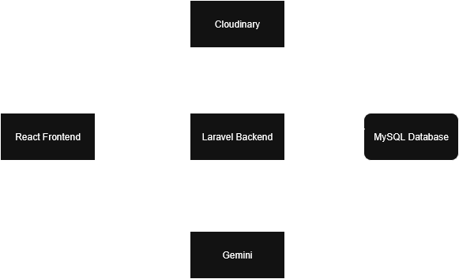

---

## 3. Main Features

- **AI Suggestions**: AI Chatbot to help find the interest-relevant books
- **Library Membership**: Easier Library Membership using authentication
- **Book Borrowing System**: Online reservation and borrowing for university members
- **Inventory Management**: Librarians can add/update/remove books and publications
- **Book Previews**: Each book card displays preview information
- **Search Functionality**: Easy discovery of available resources
- **Borrowing History**: Track past and current borrowings
- **Borrow Management**: Librarians can confirm the return of book and fine (if fined for late return) that was done in offline

---

## 4. Technologies Used

- Frontend: React, Tailwind CSS,
- Backend: Laravel, Sanctum
- Database: MySQL
- APIs: Cloudinary, Gemini, Restful API
- Other Tools: Docker, Vercel(Frontend), Railway(Database), Render(Backend)

---

## 5. System Architecture

## 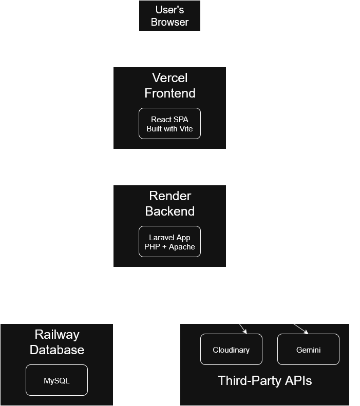

## 6. Setup Guidelines

### Backend

```bash
# Clone the repository
git clone https://github.com/NazimRaianKhan/LibraAust.git
cd Backend

# Install dependencies
composer install

# Setup environment variables
cp .env.example .env
# Add DB, Cloudinary, and Gemini API credentials

# Generate app key
php artisan key:generate

# Run migrations and seeders
php artisan migrate --seed

# Start development server
php artisan serve

```

### Frontend

```bash
cd frontend

# Install dependencies
npm install

# Setup environment variables
cp .env.example .env
# Add API URL (e.g., VITE_API_URL=http://localhost:8000/api)

# Start frontend
npm run dev
```

---

## 7. Running the Application

### Local Development:

- Frontend: http://localhost:5173

- Backend: http://localhost:8000/api

### Live Deployment:

- Frontend (Vercel): [libra-aust.vercel.app](https://libra-aust.vercel.app)

- Backend (Railway): [deploytest-1zfh.onrender.com](https://deploytest-1zfh.onrender.com)

## 8. Deployment Status & Tests

| Component | Is Deployed? | Is Dockerized? | Unit Tests Added? (Optional) | Is AI feature implemented? (Optional) |
| --------- | ------------ | -------------- | ---------------------------- | ------------------------------------- |
| Backend   | Yes          | Yes            | No                           | Yes                                   |
| Frontend  | Yes          | No             | No                           | No                                    |

## 9. Contribution Table

| Metric                        | Total | Backend | Frontend | Member 1                                                                                                                                                                                                                                                | Member 2                                                                                                                                                                                                                                                | Member 3                                                                                                                                                                                                                                                | Member 4                                                                                                                                                                                                                                                |
| ----------------------------- | ----- | ------- | -------- | ------------------------------------------------------------------------------------------------------------------------------------------------------------------------------------------------------------------------------------------------------- | ------------------------------------------------------------------------------------------------------------------------------------------------------------------------------------------------------------------------------------------------------- | ------------------------------------------------------------------------------------------------------------------------------------------------------------------------------------------------------------------------------------------------------- | ------------------------------------------------------------------------------------------------------------------------------------------------------------------------------------------------------------------------------------------------------- |
| Issues Solved                 | 27    | 12      | 15       | 8                                                                                                                                                                                                                                                       | 2                                                                                                                                                                                                                                                       | 16                                                                                                                                                                                                                                                      | 1                                                                                                                                                                                                                                                       |
| WakaTime Contribution (Hours) |       |         |          | [](https://wakatime.com/badge/user/53321020-0332-4842-9551-15adf1c7024d/project/7c1af66b-9f76-4382-9075-bfcf48505616) | [](https://wakatime.com/badge/user/91444d8d-8ee5-4246-a579-3cdb56fed006/project/39f2c80e-5729-4273-be68-33e7a5407d65) | [](https://wakatime.com/badge/user/05c510cd-06a7-4f8e-9e91-7e8a6f5cbee9/project/fd4998b5-85f5-4504-ba27-6c1cf2da9ece) | [](https://wakatime.com/badge/user/c3c34631-addf-409a-b19f-6bf0fb04b554/project/df8db335-3ade-4048-86eb-d77139f680cf) |
| Percent Contribution (%)      | 100   |         |          | 29                                                                                                                                                                                                                                                      | 8                                                                                                                                                                                                                                                       | 59                                                                                                                                                                                                                                                      | 4                                                                                                                                                                                                                                                       |

## 10. Screenshots

### Homepage

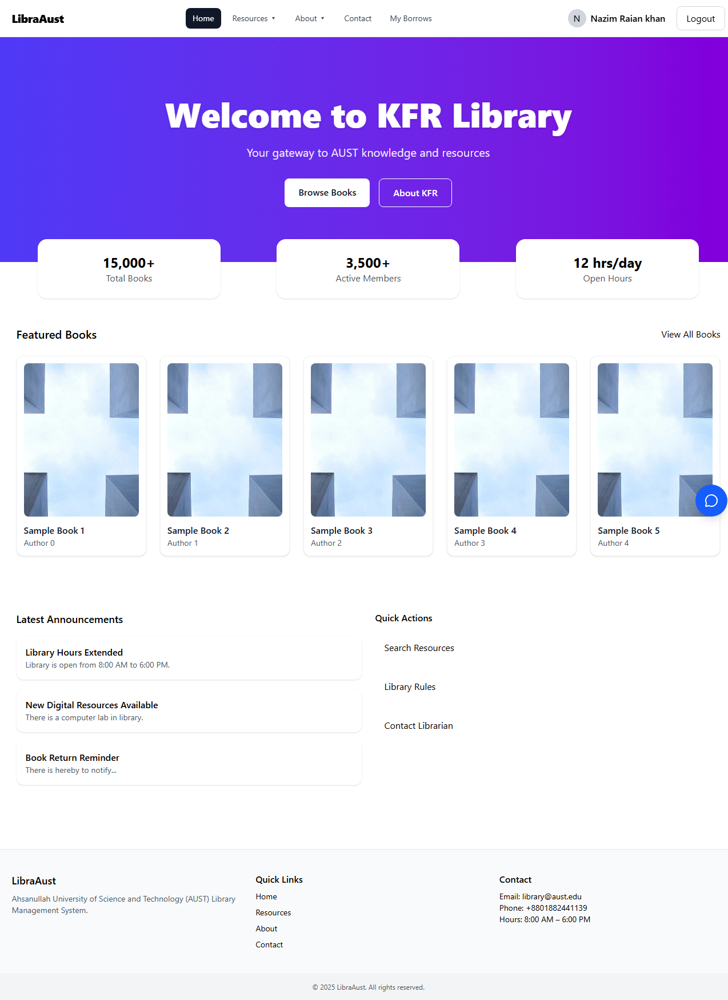

### Book Page

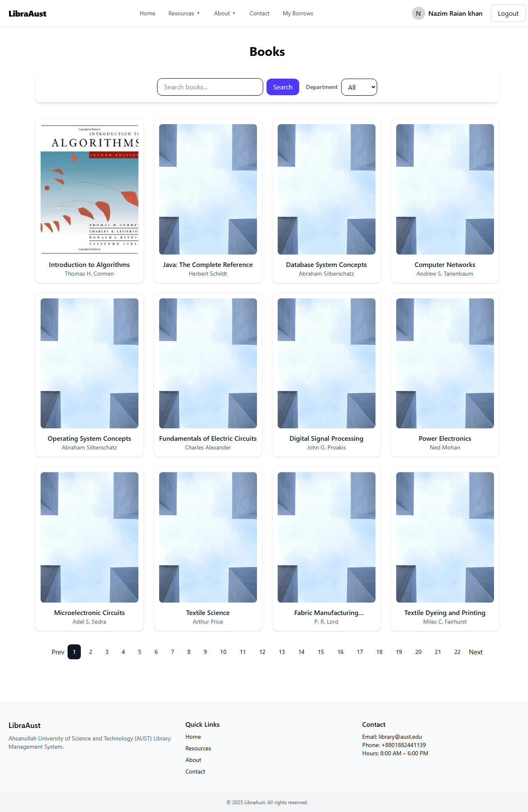

### Thesis Page

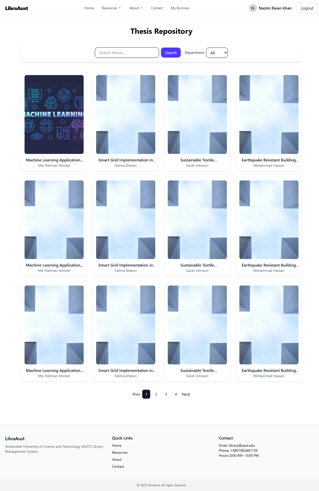

### About Page

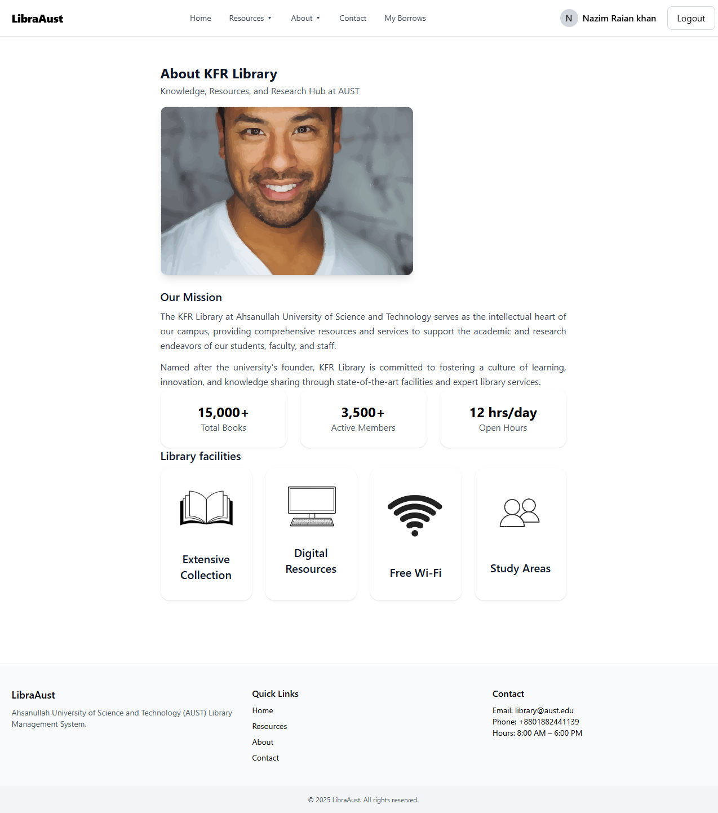

### Contact Page

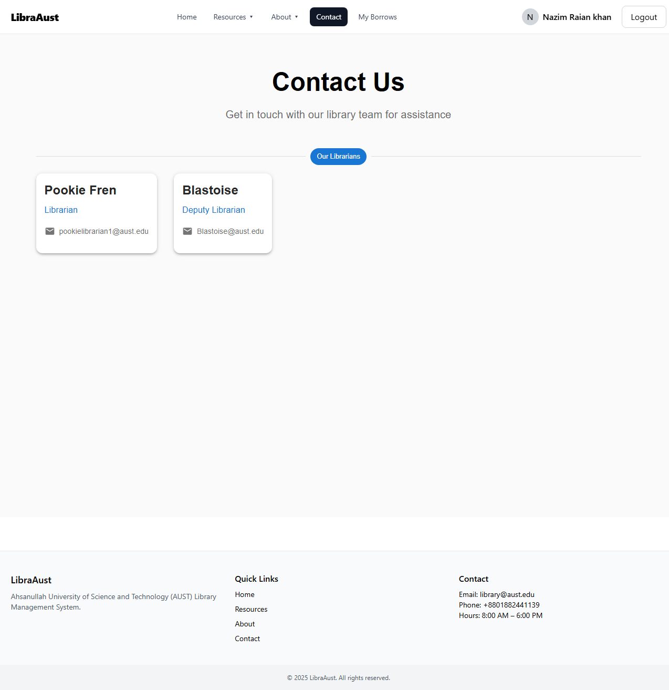

### My Borrow Page

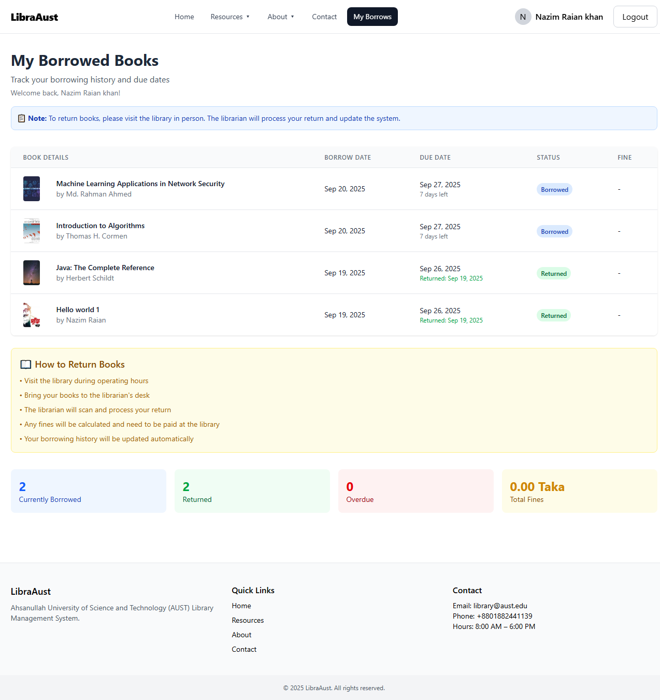

### Book Detail Page

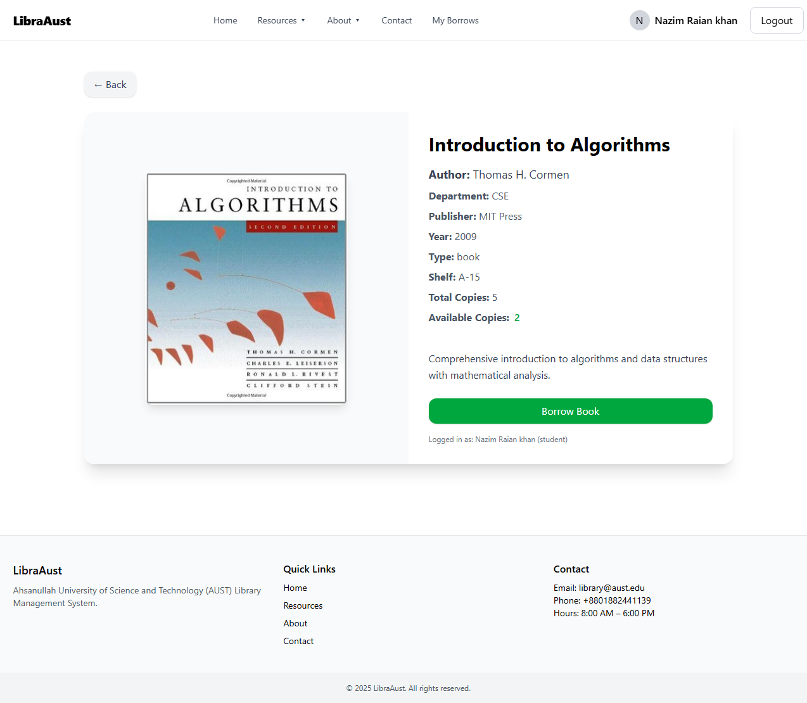

### Sign In Page

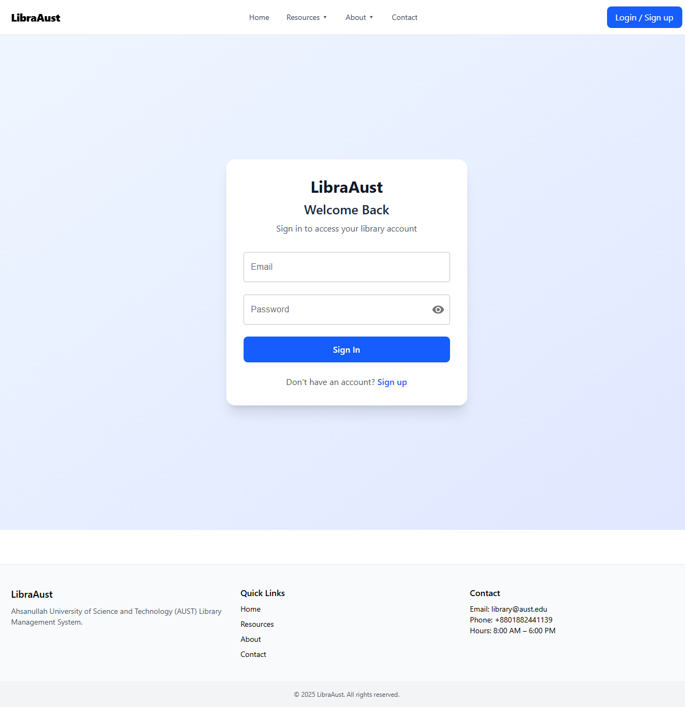

### Sign Up Page

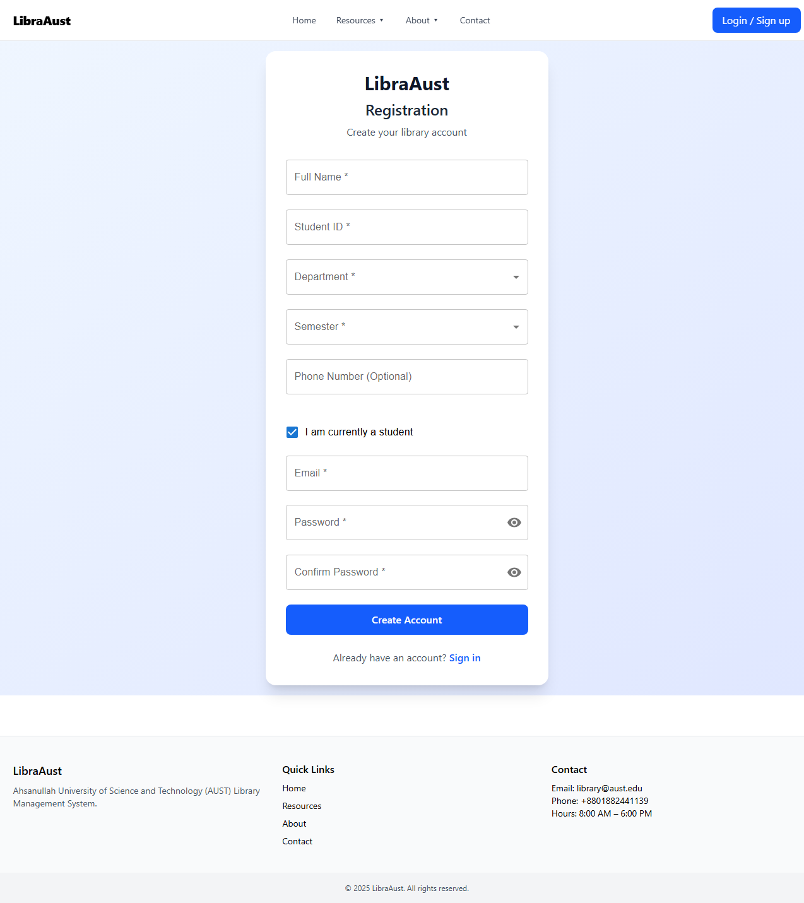

### Add Publication Page(Librarian only)

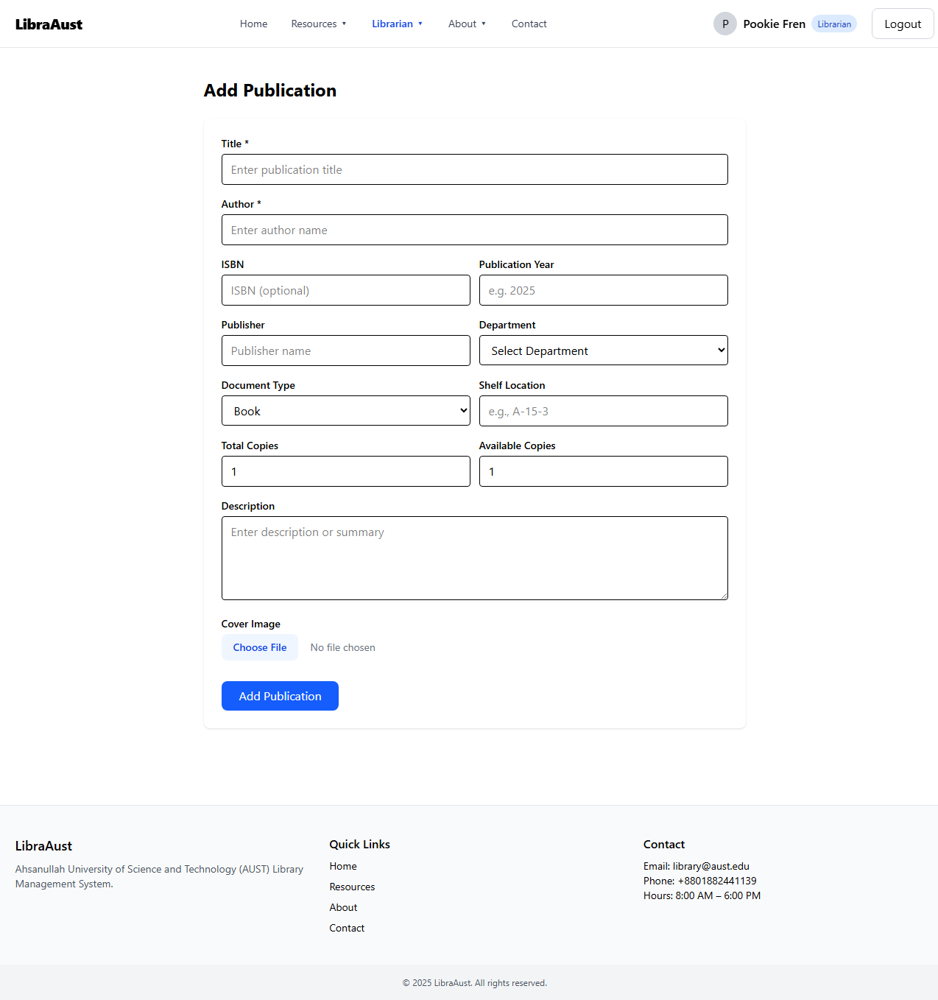

### Manage Borrow Page(Librarian only)

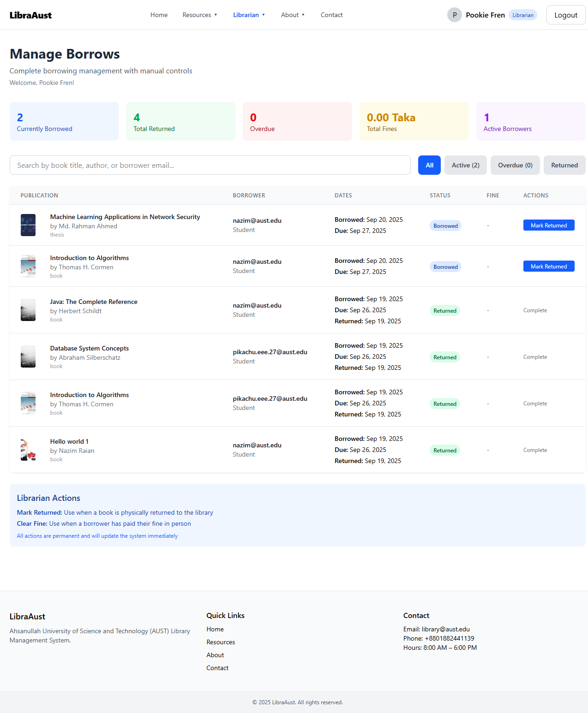

### Edit Book Page(Librarian only)

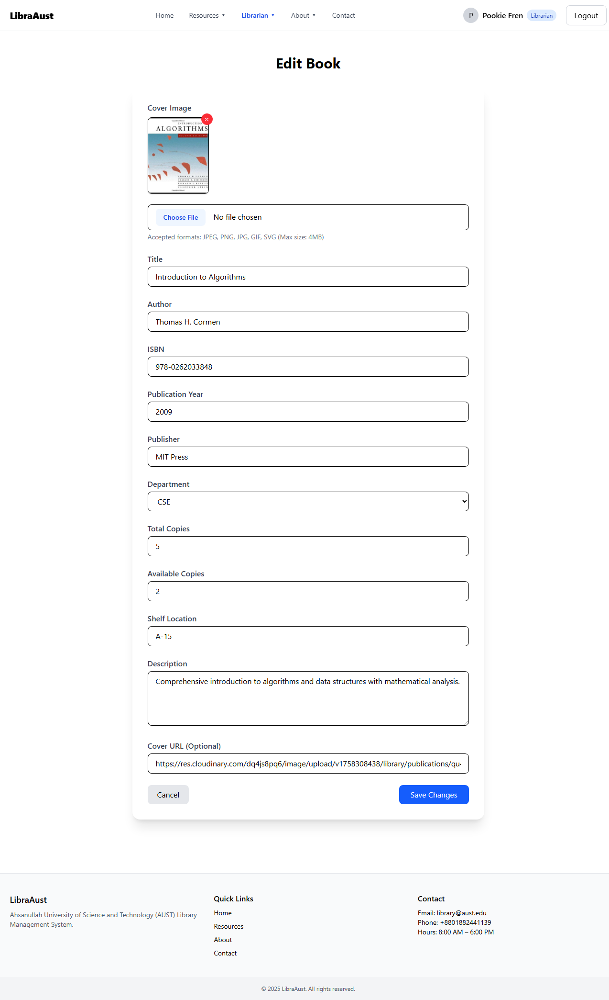

### Book Detail Page((Librarian only))


## 11. Limitations / Known Issues

- No option for account recovery
- No option for email verification or reset password
- chatbot sometimes dont work properly and only recommend based on department

## 12. UI Design

View our UI prototype on Figma: [LibraAust](https://www.figma.com/make/YtpOSa3FB7CS3hPW0d7SlH/LibraAust?fullscreen=1)
