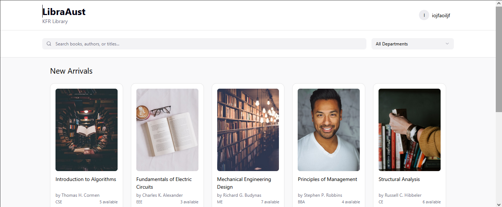
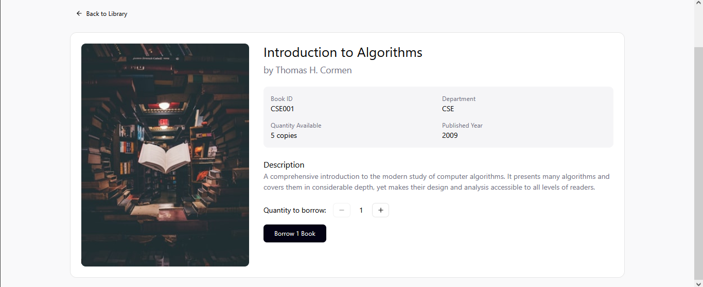

# LibraAust - University Library Management System

## Project Overview

LibraAust is a modern Library Management System designed for our university, streamlining book borrowing processes for students and faculty while providing librarians with efficient tools for inventory management.

## Project Objective

To create a digital platform that:

- Simplifies book borrowing for university members
- Provides librarians with an intuitive management interface
- Reduces manual paperwork and improves tracking of library resources

## Collaborators

Md. Aribur Rahman Dhruvo
wakatime.com/@ARDhruvo

Mohammad Yahya Bin Belal

Nazim Raian Khan

## Target Audience

- University students
- Faculty members
- Librarians and library staff

## Core Features

- **AI Suggestions**: AI Chatbot to help find the interest-relevant books
- **Library Membership**: Easier Library Membership using authentication
- **Book Borrowing System**: Online reservation and borrowing for university members
- **Inventory Management**: Librarians can add/update/remove books and publications
- **Book Previews**: Each book card displays preview information
- **Search Functionality**: Easy discovery of available resources
- **Borrowing History**: Track past and current borrowings

## Tech Stack

- **Backend**: Laravel PHP framework
- **Frontend**: React
- **Database**: MySQL

## Setup Instructions

### Backend (Laravel) Setup

1. Clone the repository: `git clone [repository-url]`
2. Navigate to backend directory: `cd libraaust/backend`
3. Install dependencies: `composer install`
4. Copy `.env.example` to `.env` and configure your database settings
5. Generate application key: `php artisan key:generate`
6. Run migrations: `php artisan migrate`
7. Seed initial data: `php artisan db:seed`
8. Start development server: `php artisan serve`

### Frontend (React) Setup

1. Navigate to frontend directory: `cd libraaust/frontend`
2. Install dependencies: `npm install`
3. Start development server: `npm run dev`

## UI Design

[Figma Link](https://www.figma.com/make/AVtp2fWsQyHB2t7s2DxByM/LibraAust-Library-Management-UI?fullscreen=1)

